Final Report: Analysis of Housing Prices in Ames, Iowa
================
Jakub Cichon
4/28/2018

Dataset
-------

Our dataset is a compilation of houses in Ames Iowa. It has 79 explanatory variables that may be helpful in determining the Sale Price of a home. The purpose of this projet is to create a model using the significant variables in the dataset to determine house sale price using the features of the home. Some of the important variables that are expected to have the most influence in the model are what could be considered obvious ones such as `TotalSqFeet` or `Neighborhood`. The main goal here is to gain insights on what the most significant predictors of SalePrice are and to build a predictive model.

##### Basic descriptive analyses

The following histogram checks the distribution of SalePrice. It looks skewed to the right with some outliers. Next to it is the same histogram but without the outliers. We notice there are 107 outliers in the data.

``` r
train <- read.csv('data/housing/train.csv')
#Look at housing price data
h1 <- ggplot(data = train) +
  geom_histogram(mapping = aes(x=SalePrice)) + labs(title = 'SalePrice Histogram') +
    theme(plot.title = element_text(size=9))
cutoff = mean(train$SalePrice) + 1.5*IQR(train$SalePrice)
h2 <- ggplot(data = (train %>% filter(SalePrice <= cutoff))) +
    geom_histogram(mapping = aes(x=SalePrice)) + 
    labs(title = 'SalePrice Histogram, Outliers Removed') +
    theme(plot.title = element_text(size=9))
grid.arrange(h1, h2, nrow = 1)
```


This test is for normality. Based on the statistic given we should try to transform the SalePrice to normalize it. Here is a Q-Q plot of the SalePrice, and the LogSalePrice which indicates normality along with the W value of nearly 1.

``` r
#Looks partly skewed right, check normality
shapiro.test(train$SalePrice)
```

    ## 
    ##  Shapiro-Wilk normality test
    ## 
    ## data:  train$SalePrice
    ## W = 0.86967, p-value < 2.2e-16

``` r
qq1 <- ggplot(data = train) + 
  geom_qq(mapping = aes(sample=SalePrice)) + labs(title = 'Normal Q-Q Plot') +
    theme(plot.title = element_text(size=9))
#Q-Q plot of the log_SalePrice
qq2 <- ggplot(data = train) + 
  geom_qq(mapping = aes(sample=log(SalePrice))) + 
    labs(title = 'Normal Q-Q Plot, Log Transformed') +
    theme(plot.title = element_text(size=9))
grid.arrange(qq1, qq2, nrow=1)
```


``` r
#Normality test for log_SalePrice
shapiro.test(log(train$SalePrice))
```

    ## 
    ##  Shapiro-Wilk normality test
    ## 
    ## data:  log(train$SalePrice)
    ## W = 0.99121, p-value = 1.149e-07

Clearly looks much more normal using a logarithmic transformation of the SalePrice, confirmed by the W value. Beside it is a graph of the log transformed data without the outliers. There is not much change because there are only 54 outliers.

``` r
# here we create a column for log_SalePrice
train <- train %>% mutate(log_SalePrice = log(SalePrice))
lh1 <- ggplot(data=train) + 
  geom_histogram(mapping = aes(x=log_SalePrice)) +
    labs(title = 'Log Transformed') +
    theme(plot.title = element_text(size=9))
#calulating outliers of sale price
log_cutoff = mean(train$log_SalePrice) + 1.5*IQR(train$log_SalePrice)
lh2 <- ggplot(data = (train %>% filter(log(SalePrice) <= cutoff))) +
  geom_histogram(mapping = aes(x=log(SalePrice)))  +
    labs(title = 'Log Transformed, Outliers Removed') +
    theme(plot.title = element_text(size=9))
grid.arrange(lh1, lh2, nrow = 1)
```


Delving into deeper analyses, we split up our data.

``` r
cat.var <- names(train)[which(sapply(train, is.factor))]
num.var <- names(train)[which(sapply(train, is.numeric))]
# create separate dataframes of categorical and numeric variables
# this is important
train.cat <- train %>% select(cat.var)
train.cont <- train %>% select(num.var)
```

Let's take a close look at our missing data. A few of the variables have a majority of missing values.

``` r
colSums(sapply(train, is.na))
```

    ##            Id    MSSubClass      MSZoning   LotFrontage       LotArea 
    ##             0             0             0           259             0 
    ##        Street         Alley      LotShape   LandContour     Utilities 
    ##             0          1369             0             0             0 
    ##     LotConfig     LandSlope  Neighborhood    Condition1    Condition2 
    ##             0             0             0             0             0 
    ##      BldgType    HouseStyle   OverallQual   OverallCond     YearBuilt 
    ##             0             0             0             0             0 
    ##  YearRemodAdd     RoofStyle      RoofMatl   Exterior1st   Exterior2nd 
    ##             0             0             0             0             0 
    ##    MasVnrType    MasVnrArea     ExterQual     ExterCond    Foundation 
    ##             8             8             0             0             0 
    ##      BsmtQual      BsmtCond  BsmtExposure  BsmtFinType1    BsmtFinSF1 
    ##            37            37            38            37             0 
    ##  BsmtFinType2    BsmtFinSF2     BsmtUnfSF   TotalBsmtSF       Heating 
    ##            38             0             0             0             0 
    ##     HeatingQC    CentralAir    Electrical     X1stFlrSF     X2ndFlrSF 
    ##             0             0             1             0             0 
    ##  LowQualFinSF     GrLivArea  BsmtFullBath  BsmtHalfBath      FullBath 
    ##             0             0             0             0             0 
    ##      HalfBath  BedroomAbvGr  KitchenAbvGr   KitchenQual  TotRmsAbvGrd 
    ##             0             0             0             0             0 
    ##    Functional    Fireplaces   FireplaceQu    GarageType   GarageYrBlt 
    ##             0             0           690            81            81 
    ##  GarageFinish    GarageCars    GarageArea    GarageQual    GarageCond 
    ##            81             0             0            81            81 
    ##    PavedDrive    WoodDeckSF   OpenPorchSF EnclosedPorch    X3SsnPorch 
    ##             0             0             0             0             0 
    ##   ScreenPorch      PoolArea        PoolQC         Fence   MiscFeature 
    ##             0             0          1453          1179          1406 
    ##       MiscVal        MoSold        YrSold      SaleType SaleCondition 
    ##             0             0             0             0             0 
    ##     SalePrice log_SalePrice 
    ##             0             0

Let's visualize what's missing. A few variables have a majority of NA entries, such as Fence, Alley, MiscFeature, and PoolQC.

``` r
plot_Missing <- function(data_in, title = NULL){
    temp_df <- as.data.frame(ifelse(is.na(data_in), 0, 1))
    temp_df <- temp_df[,order(colSums(temp_df))]
    data_temp <- expand.grid(list(x = 1:nrow(temp_df), y = colnames(temp_df)))
    data_temp$m <- as.vector(as.matrix(temp_df))
    data_temp <- data.frame(x = unlist(data_temp$x), y = unlist(data_temp$y),
                            m = unlist(data_temp$m))
    ggplot(data_temp) + 
        geom_tile(aes(x=x, y=y, fill=factor(m))) + 
        scale_fill_manual(values=c("red", "blue"), 
                          name="Missing?\n0 - Yes\n1 - No") + 
        theme_light() + ylab("") + xlab("") + ggtitle(title) +
        theme(plot.title = element_text(hjust = 0.5))
}

plot_Missing(train[,colSums(is.na(train)) > 0], title = "Scope of our missing data")
```

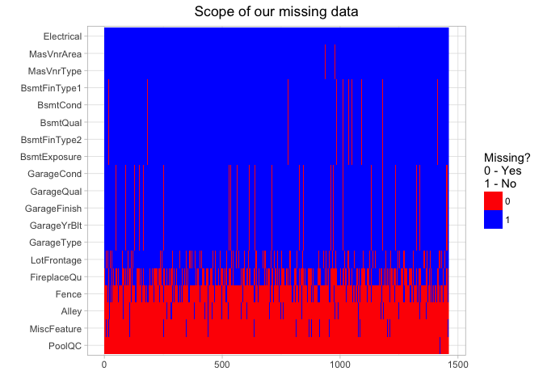 How many houses have been remodeled? According to the data description, a house was remodeled if YearBuilt differs from YearRemodAdd. It appears that about 47.67% of homes have been remodeled.

``` r
sum( train %>% select(YearRemodAdd) != train %>% select(YearBuilt) ) / dim(train)[1]
```

    ## [1] 0.4767123

``` r
train %>% select(YearBuilt, YearRemodAdd) %>%
    # select our 2 variables of interest
    mutate( Remodeled = as.factor(YearBuilt != YearRemodAdd) ) %>% 
    # create new variable that states whether home was remodeled, or not 
    ggplot( aes(x = factor( x = Remodeled, labels = c('No','Yes') ),
                fill = Remodeled) ) + 
    geom_bar() +  # plot bar chart 
    xlab('Remodeled') + ggtitle('Count of homes remodeled') +
    theme(plot.title = element_text(hjust = 0.5))
```


Next we will plot some of our more interesting categorical variables to get a better idea of the data we are dealing with.

``` r
# lets plot our categorical variables
ggplot(data=train, aes(factor(train$Neighborhood), fill = Neighborhood)) +
    geom_bar() + theme_light() + xlab('Neighborhood') +
    theme(axis.text.x = element_text(angle = 60, hjust = 1)) +
    ggtitle('Count of homes per neighborhood') +
    theme(plot.title = element_text(hjust = 0.5), legend.position = 'none')
```

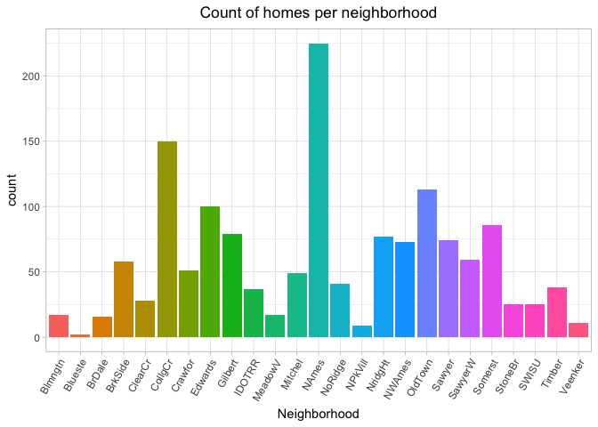

``` r
# generalize to a function
plotBars <- function(data_in, i, title = NULL){
    data <- data.frame(var <- data_in[[i]])
    
    ggplot(data=data, aes(x=factor(var), fill = var) ) + labs(fill = i) +
        geom_bar() + theme_light() + xlab(i) +
        theme(axis.text.x = element_text(angle = 60, hjust = 1)) +
        ggtitle(title) + theme(plot.title = element_text(hjust = 0.5),
                               legend.position = 'none')
}

grid.arrange(plotBars(train, 'BldgType'),
             plotBars(train, 'LotConfig'),
             plotBars(train, 'HouseStyle'),
             plotBars(train, 'Foundation'),
             nrow = 2)
```


``` r
grid.arrange(plotBars(train, 'Exterior1st'),
             plotBars(train, 'Exterior2nd'),
             plotBars(train, 'RoofStyle'),
             plotBars(train, 'BsmtQual'),
             nrow = 2)
```


Lets take a look at the sale price of homes in different neighborhoods (including outliers). We can differentiate the expensive and inexpensive areas to live.

``` r
options(scipen = 6) 
# just making R show fixed values instead of changing to scientific notation
# so it's easier to read tthe price

train %>% select(Neighborhood, SalePrice) %>%
    ggplot(aes(x = factor(Neighborhood), y = SalePrice, fill = Neighborhood) ) +
    geom_boxplot() + xlab('Neighborhoods') + theme_light() +
    theme(axis.text.x = element_text(angle = 60, hjust = 1), 
          legend.position = 'none', plot.title = element_text(hjust = 0.5)) +
    ggtitle('Box plots of sale prices in different neighborhoods')
```

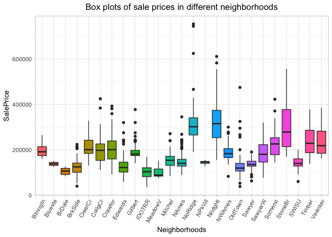

Since we will eventually build a model, we need to know the significance of our variables. Let's take a look at the correlations of our numerics. From here we can see our most highly correlated numeric variables with SalePrice and also a few other interesting insights, such as the relationship between YearBuilt and Enclosed porch being quite negative. This is suggesting that enclosed porches have waned in popularity over the years and were more common in older houses and are no longer being inlcuded in newly built homes as time goes on.

``` r
correlations <- cor(na.omit(train.cont))
row_indic <- apply(correlations, 1, function(x) sum(x > 0.3 | x < -0.3) > 1)

correlations <- correlations[row_indic, row_indic]
corrplot(correlations, method = "square", tl.col="black", tl.pos = "lt", tl.cex = .7, number.cex = .8)
```


##### Thoughts

Throughout our preliminary analysis we found many interesting relationships and discovered necessary transformations. With these findings we plan to further our project and hopefully create a supervised machine learning pricing model for Ames Iowa and to discover what truly are the most important factors determining housing prices, a glimpse of which we already saw with the very telling correlations between SalePrice and our numeric variables.

##### Taking a closer look

Continuing from where we left off, the last thing we looked at were the correlations for our numeric variables. The following visual is a correlation matrix and has the cutoff correlation as |0.5| and the correlations sorted for easier reading.

What this plot is indicative of is seemingly the most important factor for the SalePrice of a home is the overall quality (`OverallQual`) rating. This isn’t too surprising, considering a home constructed of quality materials indicates it was expensive to build and therefore sells for a lot more than a house with poorer to average quality materials. The other very strongly correlated variable, `GrLivArea` (above ground living area) is also expected, considering that living area and size logically increase with `SalePrice`. What we can also see here is that there are potentially problems with collinearity. We can see this with variables such as `GarageCars` (garage car capacity) and `GarageArea`, but that is an obvious one, considering a larger garage can of course hold more cars. Another to note is `1stFlrSF` being highly correlated with `TotalBsmtSF`, which make sense considering the first floor of a house sits atop the basement and they most likely have similar square footage. Going back to `GrLivArea`, this is highly correlated with `TotRmsAbvGrd` (total rooms above ground). This relationship also makes sense because more living area would indicate there are indeed more rooms. These are all variables to look out for and this problem will require addressing later. From what we’ve gathered here it looks that generally the `SalePrice` is greatly affected by features like size/area and quality.

``` r
correlations <- cor(all.num, use = "pairwise.complete.obs")
# correlations for all complete numeric variables
cor.sorted <- as.matrix(sort(correlations[,'SalePrice'], decreasing = TRUE))
cor.high <- names( which(apply(cor.sorted, 1, function(x) abs(x) > 0.5)) )
correlations <- correlations[cor.high, cor.high]
corrplot.mixed(correlations, tl.col="black", tl.pos = "lt",  tl.cex = .8, number.cex = .8)
```


Let’s take a closer look at out top three most highly correlated variables, `OverallQual`, `GrLivArea`, and `GarageCars`.

Here we can see the trend. This plot also indicates the greater variance in `SalePrice` as `OverallQual` increases. We can see how tightly grouped the lower quality rated houses are around certain low price points, but the the higher rated homes have wildly varying sale prices. This is an indication of heteroscedasticity, or non constant variance. This may prove to be a trend among our numeric predictors, and will have to be addressed before modeling.

``` r
# let's take a look at our highly correlated variables
ggplot(data = all[!is.na(all$SalePrice), ], 
       aes(x = factor(OverallQual), y = SalePrice, fill = factor(OverallQual)) ) +
    geom_boxplot() + labs(x = 'Overall Quality') + 
    theme(legend.position = "none") +
    scale_y_continuous(breaks = seq(0, 800000, by = 100000))
```


The plot of `GrLivArea`, or above ground living area, also seems to indicate issues with heteroscedasticity. Another problem is that there seems to be two outliers. This is an odd occurrence, considering the overall trend here is that more area means greater SalePrice, and there are two huge houses which have absurdly low prices.

``` r
cor(all$SalePrice[!is.na(all$SalePrice)], all$GrLivArea[!is.na(all$SalePrice)])
```

    ## [1] 0.7086245

``` r
ggplot(data = all[!is.na(all$SalePrice), ], aes(x = GrLivArea, y = SalePrice))+
    geom_point(col='blue') + 
    geom_smooth(method = "lm", color="black", aes(group=1)) +
    scale_y_continuous(breaks= seq(0, 800000, by = 100000))
```

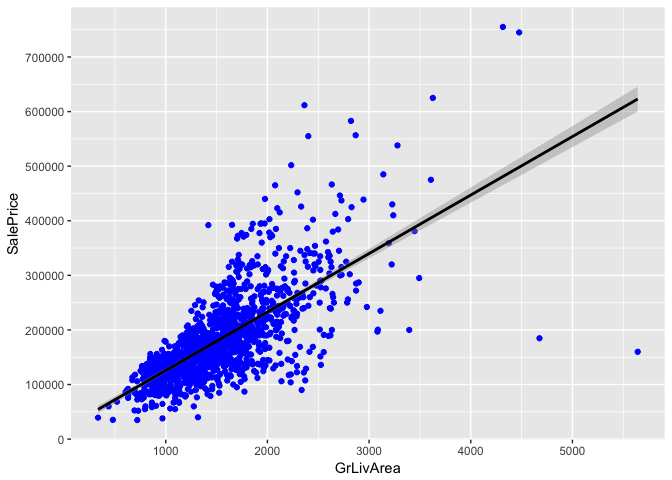

Running a simple line of code to check which rows from our data have a `GrLivArea` greater than 4500 indicates the culprits are houses `524`, `1299`, and `2550`. We don't have to worry about `2550` because that is part of the test set and has no SalePrice. Taking a closer look by pulling these specific rows and the `SalePrice`, `GrLivArea`, and `OverallQual`, `YearBuilt`, and `Neighborhood`, we see the following.

``` r
which(all$GrLivArea > 4500)
```

    ## [1]  524 1299 2550

``` r
# house 524 and 1299 are the culprits, exclude 2550 because no sale price
all[c(524, 1299, 2550), c('SalePrice', 'GrLivArea', 'OverallQual',
                          'YearBuilt', "Neighborhood")]
```

    ##      SalePrice GrLivArea OverallQual YearBuilt Neighborhood
    ## 524     184750      4676          10      2007      Edwards
    ## 1299    160000      5642          10      2008      Edwards
    ## 2550        NA      5095          10      2008      Edwards

We confirm that 2550 indeed has no sale price, and that the quality of both house 524 and 1299 is the maximum of 10. This rules out the houses selling for low prices because of low quality or poor condition. We also notice the interesting facts that all three homes are in the Edwards neighborhood, and were built around the same time. Most likely, without much more to go on, observations 524 and 1299 may have to be dropped later before the modeling stage.

The following plot is of our next highly correlated variable, `GarageCars`. We can again see what looks like non-constant variance but it is also interesting to note the quirk for houses with four-car garages.

``` r
ggplot(data = all[!is.na(all$SalePrice), ], aes(x = factor(GarageCars), y = SalePrice, 
                         fill = GarageCars)) + geom_boxplot() +
    labs(x = 'Garage Car Capacity') + theme(legend.position = "none") +
    scale_y_continuous(breaks = seq(0, 800000, by = 100000))
```

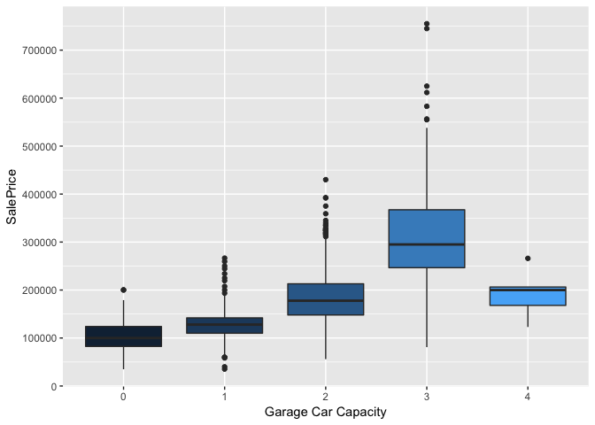

A quick look a which rows have four-car garages indicates that there are only five total (excluding houses without `SalePrice`, which of course are not represented in this plot). This can explain the relatively week numbers, there simply may not be enough observations with four-car garages

``` r
which(all$GarageCars == 4)
```

    ##  [1]  421  748 1191 1341 1351 1576 1862 1863 1864 1956 1971 2072 2238 2600
    ## [15] 2829 2906

``` r
all[c(421,  748, 1191, 1341, 1351), c('SalePrice',
                                      'GarageCars', 'OverallCond',
                                      'YearBuilt', "Neighborhood")]
```

    ##      SalePrice GarageCars OverallCond YearBuilt Neighborhood
    ## 421     206300          4           5      1997      Mitchel
    ## 748     265979          4           7      1880      OldTown
    ## 1191    168000          4           4      1961      Mitchel
    ## 1341    123000          4           5      1971        NAmes
    ## 1351    200000          4           5      1969        NAmes

Taking a look at this output when pulling the observations in question as well as some variables on interest, we can see that they are are average to below average condition, and relatively older homes, especially 748 in the OldTown neighborhood. This may be able to explain some of the reasons for the low salePrices despite the four-car garage. In fact, car capacity may not matter as much after three.

##### Fixing variables

The next steps taken were addressing the messiness of the variables and the missing values.

First of all, `LotFrontage` contained many `NA` values. To fix this, a loop was written to replace the missing value with the median `LotFrontage` value, per Neighborhood.

``` r
# it seems lot frontage has a lot of NAs, should replace with 
# median value by neighborhood
for (i in 1:nrow(all)){
    if(is.na(all$LotFrontage[i])){
        all$LotFrontage[i] <- as.integer(median(
            all$LotFrontage[all$Neighborhood==all$Neighborhood[i]], na.rm=TRUE)) 
    }
}
```

Next, it is apparent that there are some variables in the data that need converting to factor, from numeric. One of these is `MSSubClass` (identifies the type of dwelling involved in the sale). These 16 different dwellings are coded as numbers `20, 30, 40, 45, 50, …, 160, 180, 190`. They have no meaning as actual numeric values. Using the recode function, the values were reassigned to their actual meanings, taken from the `data_description.txt` file.

``` r
str(all$MSSubClass)
```

    ##  int [1:2919] 60 20 60 70 60 50 20 60 50 190 ...

``` r
all$MSSubClass <- as.factor(all$MSSubClass)
levels(all$MSSubClass)
```

    ##  [1] "20"  "30"  "40"  "45"  "50"  "60"  "70"  "75"  "80"  "85"  "90" 
    ## [12] "120" "150" "160" "180" "190"

``` r
# recode the factor levels for easier understanding
all$MSSubClass <- recode(all$MSSubClass, '20' = '1-STORY 1946 & NEWER ALL STYLES',
                         '30' = '1-STORY 1945 & OLDER',
                         '40' = '1-STORY W/FINISHED ATTIC ALL AGES',
                         '45' = '1-1/2 STORY - UNFINISHED ALL AGES',
                         '50' = '1-1/2 STORY FINISHED ALL AGES',
                         '75' = '2-1/2 STORY ALL AGES',
                         '80' = 'SPLIT OR MULTI-LEVEL',
                         '85' = 'SPLIT FOYER',
                         '90' = 'DUPLEX - ALL STYLES AND AGES',
                         '120' = '1-STORY PUD - 1946 & NEWER',
                         '150' = '1-1/2 STORY PUD - ALL AGES',
                         '160' = '2-STORY PUD - 1946 & NEWER',
                         '180' = 'PUD - MULTILEVEL - INCL SPLIT LEV/FOYER',
                         '190' = '2 FAMILY CONVERSION - ALL STYLES AND AGES')

str(all$MSSubClass)
```

    ##  Factor w/ 16 levels "1-STORY 1946 & NEWER ALL STYLES",..: 6 1 6 7 6 5 1 6 5 16 ...

``` r
levels(all$MSSubClass)
```

    ##  [1] "1-STORY 1946 & NEWER ALL STYLES"          
    ##  [2] "1-STORY 1945 & OLDER"                     
    ##  [3] "1-STORY W/FINISHED ATTIC ALL AGES"        
    ##  [4] "1-1/2 STORY - UNFINISHED ALL AGES"        
    ##  [5] "1-1/2 STORY FINISHED ALL AGES"            
    ##  [6] "60"                                       
    ##  [7] "70"                                       
    ##  [8] "2-1/2 STORY ALL AGES"                     
    ##  [9] "SPLIT OR MULTI-LEVEL"                     
    ## [10] "SPLIT FOYER"                              
    ## [11] "DUPLEX - ALL STYLES AND AGES"             
    ## [12] "1-STORY PUD - 1946 & NEWER"               
    ## [13] "1-1/2 STORY PUD - ALL AGES"               
    ## [14] "2-STORY PUD - 1946 & NEWER"               
    ## [15] "PUD - MULTILEVEL - INCL SPLIT LEV/FOYER"  
    ## [16] "2 FAMILY CONVERSION - ALL STYLES AND AGES"

Another variable that needed converting to factor was `MoSold` (month sold). These are coded as 1 through 12 but the numbers don't actually indicate anything of order, being sold in December is not 'greater' than being sold in January.

``` r
str(all$MoSold)
```

    ##  int [1:2919] 2 5 9 2 12 10 8 11 4 1 ...

``` r
all$MoSold <- as.factor(all$MoSold)
str(all$MoSold)
```

    ##  Factor w/ 12 levels "1","2","3","4",..: 2 5 9 2 12 10 8 11 4 1 ...

The next problem was the variables that were ordinal, such as ones indicating quality, but were coded as characters. These, as well as their missing values, are replaced. The same or similar procedure is used for `KitchenQual`, `ExterQual`, `ExterCond`, `HeatingQC`, `CentralAir`, `LandSlope`, `Street` (gravel or paved indicator, not street name), and `PavedDrive`.

``` r
all$KitchenQual <- as.character(all$KitchenQual)
# replace the missing values as 'typical' quality
all$KitchenQual[is.na(all$KitchenQual)] <- 'TA' 
# values are ordinal, so recode variables
all$KitchenQual <- as.integer(recode(all$KitchenQual, 'None' = 0, 
                                   'Po' = 1, 'Fa' = 2, 'TA' = 3,
                                   'Gd' = 4, 'Ex' = 5 ))
table(all$KitchenQual)
```

    ## 
    ##    2    3    4    5 
    ##   70 1493 1151  205

``` r
# exterior quality and exterior condition can be treated in the same way
# values are ordinal, so recode variables
all$ExterQual <- as.integer(recode(all$ExterQual, 'None' = 0, 
                                   'Po' = 1, 'Fa' = 2, 'TA' = 3,
                                   'Gd' = 4, 'Ex' = 5 ))
table(all$ExterQual)
```

    ## 
    ##    2    3    4    5 
    ##   35 1798  979  107

``` r
all$ExterCond <- as.integer(recode(all$ExterCond, 'None' = 0, 
                                   'Po' = 1, 'Fa' = 2, 'TA' = 3,
                                   'Gd' = 4, 'Ex' = 5 ))

# heating and central air can also be edited in the same way
all$HeatingQC<-as.integer(recode(all$HeatingQC, 'None' = 0, 
                                  'Po' = 1, 'Fa' = 2, 'TA' = 3,
                                  'Gd' = 4, 'Ex' = 5))

all$CentralAir<-as.integer(recode(all$CentralAir, 'N' = 0, 
                                  'Y' = 1))

# same with slope of property
all$LandSlope<-as.integer(recode(all$LandSlope,'Sev'=0,
                                 'Mod'=1, 'Gtl'=2))

# as well as type road, and paved driveway
all$Street<-as.integer(recode(all$Street,'Grvl'=0, 'Pave'=1))

all$PavedDrive<-as.integer(recode(all$PavedDrive, 'N'=0, 'P'=1, 'Y'=2))
```

As we noted before when looking at our missing value plot, we noticed distinct groups of variables missing. Let's take a quick look at the count for variables that have `NA` entries

``` r
na_count <- sapply(all, function(y) sum(length(which(is.na(y)))))
na_count <- data.frame(na_count)
na_count %>% rownames_to_column("variable") %>% filter(na_count, na_count > 0)
```

    ##        variable na_count
    ## 1      MSZoning        4
    ## 2         Alley     2721
    ## 3     Utilities        2
    ## 4   Exterior1st        1
    ## 5   Exterior2nd        1
    ## 6    MasVnrType       24
    ## 7    MasVnrArea       23
    ## 8      BsmtQual       81
    ## 9      BsmtCond       82
    ## 10 BsmtExposure       82
    ## 11 BsmtFinType1       79
    ## 12   BsmtFinSF1        1
    ## 13 BsmtFinType2       80
    ## 14   BsmtFinSF2        1
    ## 15    BsmtUnfSF        1
    ## 16  TotalBsmtSF        1
    ## 17   Electrical        1
    ## 18 BsmtFullBath        2
    ## 19 BsmtHalfBath        2
    ## 20   Functional        2
    ## 21  FireplaceQu     1420
    ## 22   GarageType      157
    ## 23  GarageYrBlt      159
    ## 24 GarageFinish      159
    ## 25   GarageCars        1
    ## 26   GarageArea        1
    ## 27   GarageQual      159
    ## 28   GarageCond      159
    ## 29       PoolQC     2909
    ## 30        Fence     2348
    ## 31  MiscFeature     2814
    ## 32     SaleType        1
    ## 33    SalePrice     1459

Some of the big offenders include the Garage and Basement related variables. To take care of these, first of all missing `GarageYrBuilt` entries were replaced with YearBuilt. All of the NAs in `GarageType` were replaced with 'No Garage', NAs in `GarageFinish` were replaced with 'None' and then this variable was recoded because it is ordinal, and `GarageQual` and `GarageCond` were treated in the same way.

``` r
# replace missing garage year built with the year built of the house
all$GarageYrBlt[is.na(all$GarageYrBlt)] <- all$YearBuilt[is.na(all$GarageYrBlt)]

# assume NA means no garage, so replace that
all$GarageType <- as.character(all$GarageType)
all$GarageType[is.na(all$GarageType)] <- 'No Garage'
all$GarageType <- as.factor(all$GarageType)
table(all$GarageType)
```

    ## 
    ##    2Types    Attchd   Basment   BuiltIn   CarPort    Detchd No Garage 
    ##        23      1723        36       186        15       779       157

``` r
# next deal with garage finish
all$GarageFinish <- as.character(all$GarageFinish)
all$GarageFinish[is.na(all$GarageFinish)] <- 'None'
# values are ordinal, so recode variables
all$GarageFinish<-as.integer(recode(all$GarageFinish,
                                    'None' = 0, 'Unf' = 1, 
                                    'RFn' = 2, 'Fin' = 3))

# deal with garage quality now, this is also an ordinal variable
all$GarageQual <- as.character(all$GarageQual)
all$GarageQual[is.na(all$GarageQual)] <- 'None'
all$GarageQual<-as.integer(recode(all$GarageQual, 'None' = 0, 
                                  'Po' = 1, 'Fa' = 2, 'TA' = 3,
                                  'Gd' = 4, 'Ex' = 5 ))

# same story with the garage condition variable
all$GarageCond <- as.character(all$GarageCond)
all$GarageCond[is.na(all$GarageCond)] <- 'None'
all$GarageCond<-as.integer(recode(all$GarageCond, 'None' = 0, 
                                   'Po' = 1, 'Fa' = 2, 'TA' = 3,
                                   'Gd' = 4, 'Ex' = 5 ))
```

As stated, the Basement variables were the next batch that needed taking care of. `BsmtQual`, `BsmtCond`, `BsmtExposure`, `BsmtFinType1`, and `BsmtFinType2` were all fixed in the same way as Garage variables. The remaining seven Basement related variables only had a few missing entries: `BsmtFullBath`, `BsmtHalfBath`, `BsmtFinSF1`, `BsmtFinSF2`, `BsmtUnfSF`, and `TotalBsmtSF`. Their `NA` values were replaced with 0.

``` r
# basement quality is rated in the same scale as garage, 
# let's fix it in a similar way by making it ordinal
all$BsmtQual <- as.character(all$BsmtQual)
all$BsmtQual[is.na(all$BsmtQual)] <- 'None'
all$BsmtQual<-as.integer(recode(all$BsmtQual, 'None' = 0, 
                                'Po' = 1, 'Fa' = 2, 'TA' = 3,
                                'Gd' = 4, 'Ex' = 5 ))
table(all$BsmtQual)
```

    ## 
    ##    0    2    3    4    5 
    ##   81   88 1283 1209  258

``` r
# basement condition can be fixed in the same way
all$BsmtCond <- as.character(all$BsmtCond)
all$BsmtCond[is.na(all$BsmtCond)] <- 'None'
all$BsmtCond<-as.integer(recode(all$BsmtCond, 'None' = 0, 
                                'Po' = 1, 'Fa' = 2, 'TA' = 3,
                                'Gd' = 4, 'Ex' = 5 ))

# basement exposure can also be made oridnal
all$BsmtExposure <- as.character(all$BsmtExposure)
all$BsmtExposure[is.na(all$BsmtExposure)] <- 'None'
all$BsmtExposure<-as.integer(recode(all$BsmtExposure, 'None' = 0,
                                     'No' = 1, 'Mn' = 2,
                                     'Av' = 3, 'Gd' = 4))

# basement finish type 1 is a rating of the finished basement area.
# this can also be made ordinal. again, assume NA means no basement
all$BsmtFinType1 <- as.character(all$BsmtFinType1)
all$BsmtFinType1[is.na(all$BsmtFinType1)] <- 'None'
all$BsmtFinType1<-as.integer(recode(all$BsmtFinType1, 'None' = 0,
                                    'Unf' = 1, 'LwQ' = 2,
                                    'Rec' = 3, 'BLQ' = 4,
                                    'ALQ' = 5, 'GLQ' = 6 ))

# there is also basement finish type 2, for multiple types.
# this can be addressed in the same way
all$BsmtFinType2 <- as.character(all$BsmtFinType2)
all$BsmtFinType2[is.na(all$BsmtFinType2)] <- 'None'
all$BsmtFinType2<-as.integer(recode(all$BsmtFinType2, 'None' = 0,
                                    'Unf' = 1, 'LwQ' = 2,
                                    'Rec' = 3, 'BLQ' = 4,
                                    'ALQ' = 5, 'GLQ' = 6 ))

# remaining basement variables have a few NAs, replace with 0,
# this will indicate there is no full bath / half bath / etc.

# basement half bathrooms
all$BsmtFullBath[is.na(all$BsmtFullBath)] <- 0
# basement full bathrooms
all$BsmtHalfBath[is.na(all$BsmtHalfBath)] <-0
# finished basement type 1 square feet
all$BsmtFinSF1[is.na(all$BsmtFinSF1)] <-0
# finished basement type 2 square feet
all$BsmtFinSF2[is.na(all$BsmtFinSF2)] <-0
# unfinished basement area square feet
all$BsmtUnfSF[is.na(all$BsmtUnfSF)] <-0
# total basement square feet
all$TotalBsmtSF[is.na(all$TotalBsmtSF)] <-0
```

`FireplaceQu` is another quality variable that has missing values, but in this case it is about 1420 `NA` entries. This was addressed in the same way as the `GarageQual` and `BsmtQual`.

``` r
# fireplace quality has a ton of missing values, but we can fix this 
all$FireplaceQu <- as.character(all$FireplaceQu)
all$FireplaceQu[is.na(all$FireplaceQu)] <- 'None'
all$FireplaceQu <- as.integer(recode(all$FireplaceQu, 'None' = 0, 
                                  'Po' = 1, 'Fa' = 2, 'TA' = 3,
                                  'Gd' = 4, 'Ex' = 5 ))
table(all$FireplaceQu)
```

    ## 
    ##    0    1    2    3    4    5 
    ## 1420   46   74  592  744   43

Once again, we can take a look at our missing data plot and notice that now with some cleaning we have much less missing values. The approach moving on will be to drop `Fence`, `Alley`, `MiscFeature`, and `PoolQc` entirely. Then, any rows still containing `NA` in any column will be dropped, except for SalePrice. This way we can lose the minimal amount of rows possible.

``` r
# reassign our variables after the changes, 
# we have more numerical variables now
num.var <- which(sapply(all, is.numeric)) # index vector of numeric variables
fac.var <- which(sapply(all, is.factor)) # index vector of factor variables

cat(length(num.var), 'numeric variables, and', length(fac.var),
    'categorical variables')
```

    ## 53 numeric variables, and 28 categorical variables

``` r
plot_Missing(all[,colSums(is.na(all)) > 0],
             title = "Scope of our missing data after cleaning")
```


Another thing to revisit after the cleaning is the correlation matrix. We can see that new variables have now entered the |0.5| correlation threshold, and we have 16 total instead of the previous 10. Among the new variables are `ExterQual`, `KitchenQual`, `BsmtQual`, `GarageFinish`, `FireplaceQu`, and `GarageYrBlt`. One thing to notice is that we have another issue of collinearity with the introduction of GarageYrBlt. After fixing it by replacing the `NA` entries with the `YearBuilt` value, we know of course have a very high correlation of 0.85 between the two. And not to forget, the previous issues with collinearity are still here and haven’t been fixed quite yet. However, overall these are promising signs, indicating there are more significant variables after having addressed the issues concerning their labeling and this can only help the model built later on.

``` r
all.num <- all %>% select(num.var)
correlations <- cor(all.num, use = "pairwise.complete.obs")
# correlations for all complete numeric variables

cor.sorted <- as.matrix(sort(correlations[,'SalePrice'], decreasing = TRUE))
cor.high <- names( which(apply(cor.sorted, 1, function(x) abs(x) > 0.5)) )

correlations <- correlations[cor.high, cor.high]
corrplot.mixed(correlations, tl.col = "black", tl.pos = "lt",
               tl.cex = .7, cl.cex = .7, number.cex = .6)
```


``` r
# we have many more variables now that have high correlation with sale price
```

One clearly important aspect of a house is size. Next, we plot the square-footage-related variables, including our highly correlated `GrLivArea`, to get a visual of their distributions.

``` r
g1 <- ggplot(data = all, aes(x=GrLivArea)) +
    geom_density() + labs(x='Above ground living area square feet')

g2 <- ggplot(data = all, aes(x=as.factor(TotRmsAbvGrd))) +
    geom_histogram(stat='count') + labs(x='Total rooms above ground')

g3 <- ggplot(data = all, aes(x=X1stFlrSF)) +
    geom_density() + labs(x='First Floor square feet')

g4 <- ggplot(data = all, aes(x=X2ndFlrSF)) +
    geom_density() + labs(x='Second floor square feet')

g5 <- ggplot(data = all, aes(x=TotalBsmtSF)) +
    geom_density() + labs(x='Total square feet of basement area')

g6 <- ggplot(data = all, aes(x=LowQualFinSF)) +
    geom_histogram() + labs(x='Low quality finished square feet (all floors)')

g7 <- ggplot(data = all[all$LotArea<100000,], aes(x=LotArea)) +
    geom_density() + labs(x='Lot size in square feet')

g8 <- ggplot(data = all, aes(x=LotFrontage)) +
    geom_density() + labs(x='Linear feet of street connected to property')

grid.arrange(g1,g2,g3,g4,g5,g6,g7,g8, nrow = 4)
```

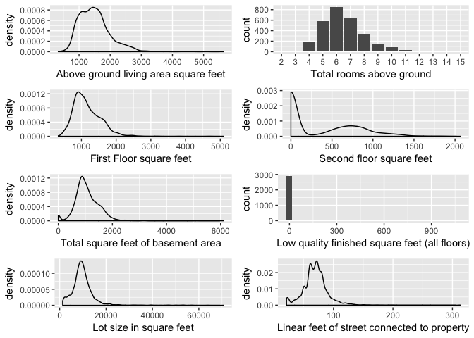

 

##### Creating new features

Next we are going to work on creating some new variables by consolidating ones we already have. The bathroom-related variables themselves don't have high correlation, but what if all bathroom variables were combined into a total bath count?

``` r
all$TotalBath <- all$FullBath + (all$HalfBath*0.5) + 
    all$BsmtFullBath + (all$BsmtHalfBath*0.5)
# there is a clear correlation here now, 0.63
cor(all$SalePrice[!is.na(all$SalePrice)], all$TotalBath[!is.na(all$SalePrice)])
```

    ## [1] 0.6317311

``` r
ggplot(data=all[!is.na(all$SalePrice),], aes(x=as.factor(TotalBath), y=SalePrice))+
    geom_point(col = 'blue') + 
    geom_smooth(method = "lm", color="black", aes(group=1)) +
    scale_y_continuous(breaks= seq(0, 800000, by=100000))
```

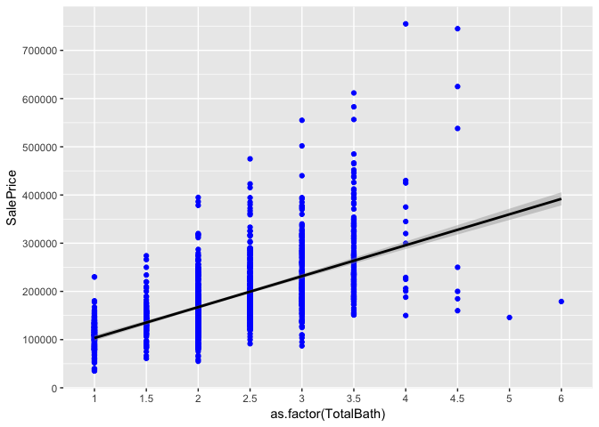 The correlation between `TotalBath` and SalePrice is 0.6317. As we can see, there definitely is a trend. It may be affected by non-constant variance.

Another variable that we can create is the age of a house, by subtracting `YearRemodAdd` from `YrSold` (recall, `NA` values in `YearRemodAdd` were replaced with `YearBuilt`). A binary variable, `Remod`, on whether a house has been remodeled or not can also be created, by simply comparing `YearBuilt` and `YearRemodAdd`, with 0 if they are the same, and 1 if there are different (indicating the year remodeled does not equal year built and therefore it has been remodeled).

``` r
# house age and binary 'remodeled' variable
all$Remod <- ifelse(all$YearBuilt==all$YearRemodAdd, 0, 1)
# recall, NAs in year remodeled were replaced with year built
all$Age <- as.numeric(all$YrSold)-all$YearRemodAdd

# clear negative correlation between house age and sale price, makes sense
cor(all$SalePrice[!is.na(all$SalePrice)], all$Age[!is.na(all$SalePrice)])
```

    ## [1] -0.5090787

``` r
ggplot(data=all[!is.na(all$SalePrice),], aes(x=Age, y=SalePrice))+
    geom_point(col='darkblue') + 
    geom_smooth(method = "lm", color="black", aes(group=1)) +
    scale_y_continuous(breaks= seq(0, 800000, by=100000))
```

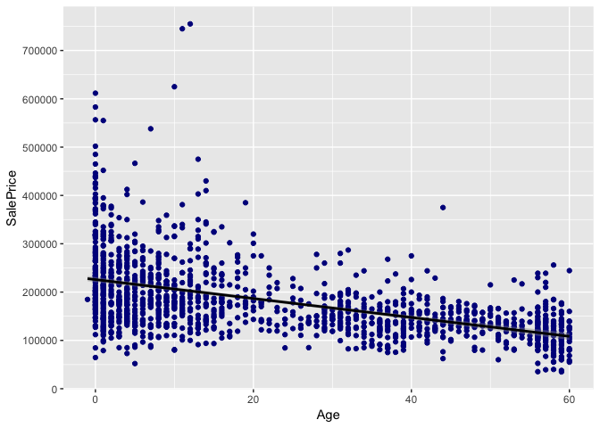 There is a clear negative correlation here between Age and SalePrice, and that is not surprising as it indicates that older houses sell for less. The correlation here is -0.5090.

Next is a variable that indicates if a house is new or not, indicated by 1 or 0. `NewHouse` is created by comparing `YearBuilt` and `YrSold` and if they are the same it is new, and therefore 1, and 0 otherwise. Now `YrSold` can be converted to a factor, because a higher year does not mean it is *better* in any sense.

``` r
# create a new variable indicating if house is new or not by comparing 
# if the year sold is equal to year built
all$NewHouse <- ifelse(all$YrSold==all$YearBuilt, 1, 0)
table(all$NewHouse)
```

    ## 
    ##    0    1 
    ## 2803  116

``` r
all$YrSold <- as.factor(all$YrSold)
```

There are also multiple porch-related square footage variables (`OpenPorchSF`, `EnclosedPorch`, `X3SsnPorch`, and `ScreenPorch`) that will be consolidated into one, `TotalPorchSF`. This will be done in the same way that `TotalBath` was created. The correlation is 0.1957, which is very weak, and indicates that there isn't much of an association between porches and the price of a home, so they may simply not matter.

``` r
# lets also consolidate the multiple porch variables into one
all$TotalPorchSF <- all$OpenPorchSF + all$EnclosedPorch +
    all$X3SsnPorch + all$ScreenPorch
# doesn't seem extremely significant
cor(all$SalePrice[!is.na(all$SalePrice)], all$TotalPorchSF[!is.na(all$SalePrice)])
```

    ## [1] 0.1957389

Last, a `TotalSqFeet` variable is created in the same way as the porch and bathroom variables were, by combining `GrLivArea` and `TotalBsmtSF`. The correlation with `SalePrice` is 0.7789.

``` r
all$TotalSqFeet <- all$GrLivArea + all$TotalBsmtSF
# obvious high correlation here
cor(all$SalePrice[!is.na(all$SalePrice)], all$TotalSqFeet[!is.na(all$SalePrice)])
```

    ## [1] 0.7789588

We know that our most important categorical variable has to be Neighborhood. We saw earlier in our plot of `SalePrice` by `Neighborhood` that there is a clear price difference based on area.

``` r
n1 <- ggplot(all[!is.na(all$SalePrice),], aes(x=Neighborhood, y=SalePrice)) +
    geom_bar(stat='summary', fun.y = "median", fill='darkblue') +
    theme(axis.text.x = element_text(angle = 45, hjust = 1)) +
    scale_y_continuous(breaks = seq(0, 800000, by = 50000)) +
    geom_label(stat = "count", aes(label = ..count.., y = ..count..), size=3) +
    # the dashed line is median SalePrice
    geom_hline(yintercept = 163000, linetype = "dashed", color = "red") 

n2 <- ggplot(data=all[!is.na(all$SalePrice),], aes(x=Neighborhood)) +
    geom_histogram(stat='count') +
    geom_label(stat = "count", aes(label = ..count.., y = ..count..), size=3) +
    theme(axis.text.x = element_text(angle = 45, hjust = 1))
```

    ## Warning: Ignoring unknown parameters: binwidth, bins, pad

``` r
grid.arrange(n1, n2)
```

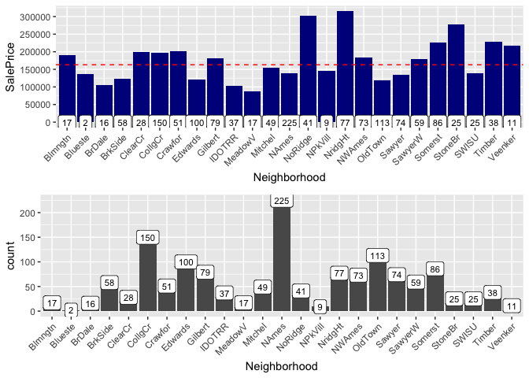 The above plot indicates which neighborhoods have median sale prices above the overall median of 163000, the dotted red line. With this plot we can clearly compare the count of houses sold and their sale prices. (Note that the counts are different in the top and bottom because the plot of SalePrice only includes houses with sale prices, while the bottom contains all houses from the whole data set.) We again notice that the most houses sold are in the NAmes neighborhood, and that the median price of a house there is below the overall median price. This indicates that it is generally a more affordable place to live. We should categorize `Neighborhood` into a new variable, `NeighborhoodExp`, indicating what kind of neighborhood the house is in according to the prices. The graph below is similar to the top plot in the graph above, but the neighborhoods have been reordered by their median SalePrice so that a clear hierarchy can be observed.

We notice that the most expensive areas are `StoneBr`, `NoRidge`, and `NridgHt`, and the cheapest are `MeadowV`, `IDOTRR`, and `BrDale`. We can probably categorize three distinct areas, expensive, cheap, and in-between. `StoneBr`, `NoRidge`, and `NridgHt` are coded as 2, `MeadowV`, `IDOTRR`, and `BrDale` are coded as 0, and neighborhoods that are not these six are coded as 1.

``` r
# next we will categorize neightboorhood
ggplot(all[!is.na(all$SalePrice),], 
       aes(x=reorder(Neighborhood, SalePrice, FUN=median), y=SalePrice)) +
    geom_bar(stat='summary', fun.y = "median", fill='darkblue') + 
    labs(x='Neighborhood', y='Median SalePrice') +
    theme(axis.text.x = element_text(angle = 45, hjust = 1)) +
    scale_y_continuous(breaks = seq(0, 800000, by=50000)) +
    geom_label(stat = "count", aes(label = ..count.., y = ..count..), size=3) +
    # dashed line = median SalePrice
    geom_hline(yintercept=163000, linetype="dashed", color = "red") 
```

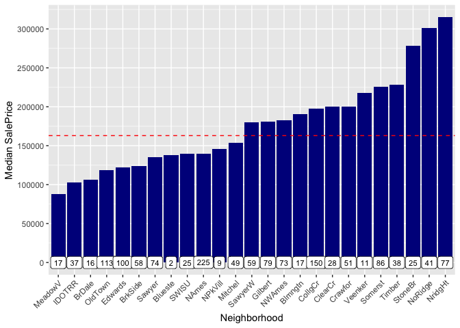

``` r
# as we can see, there are some very expensive areas like StoneBr, NoRidge,
# and NridgHt, we can probably categroize 3 areas, rich, poor, and in-between

# lets create a new variable, NeighborhoodRich, where 0 = three poorest,
# 2 = three richest, and 1 = all others
all$NeighborhoodExp[all$Neighborhood %in% c('StoneBr', 'NridgHt', 'NoRidge')] <- 2
all$NeighborhoodExp[!all$Neighborhood %in% c('MeadowV', 'IDOTRR',
                                              'BrDale', 'StoneBr',
                                              'NridgHt', 'NoRidge')] <- 1
all$NeighborhoodExp[all$Neighborhood %in% c('MeadowV', 'IDOTRR', 'BrDale')] <- 0
table(all$NeighborhoodExp)
```

    ## 
    ##    0    1    2 
    ##  160 2471  288

##### Last steps in preparing to model

The next step to take in preparing to model would be to finally take care of the rest of the `NA` values and the outliers we noticed earlier. We remove houses `524` and `1299`, and our correlation between `GrLivArea` and `SalePrice` increases to 0.735, from a previous 0.71.

``` r
all <- all[-c(524, 1299),]
```

We notice that `GarageQual` and `GarageCond` are very strongly correlated, as well as `YearRemodAdd` and `Age`.

``` r
cor(all$GarageQual[!is.na(all$SalePrice)], all$GarageCond[!is.na(all$SalePrice)])
```

    ## [1] 0.9591677

``` r
cor(all$YearRemodAdd[!is.na(all$SalePrice)], all$Age[!is.na(all$SalePrice)])
```

    ## [1] -0.9979274

We should remove these variables, as well as others that have been identified as having issues with collinearity. `GarageYrBlt`, `GarageArea`, `TotalBsmtSF`, `TotRmsAbvGrd`, `YearRemodAdd`, and `GarageCond` are all removed for having been identified as having high correlation with another predictor, that had stronger correlation with `SalePrice` and so was kept.

``` r
# drop variables where 2 variables were highly correlated,
# year remodeled is now highly correlated with Age, its redundant
# garage quality and condition are highly correlated, drop cond
all <- all %>% select(-c(GarageYrBlt, GarageArea, 
                  TotalBsmtSF, TotRmsAbvGrd,
                  YearRemodAdd, GarageCond))
```

We also can now completely wipe out `Alley`, `PoolQC`, `Fence`, and `MiscFeature` because of the enormous amount of `NA` values they have. If more time were available, it would be spent on also giving these variables attention and attempting to fix them. As it is, this is how we will have to proceed. Below is a visualization of our missing data after removing the variables.

``` r
# drop these variables that have huge amount of NA values
all <- all %>% select(-c(Alley, PoolQC, Fence, MiscFeature))

plot_Missing(all[,colSums(is.na(all)) > 0], title = "Scope of our missing data after variable removal")
```

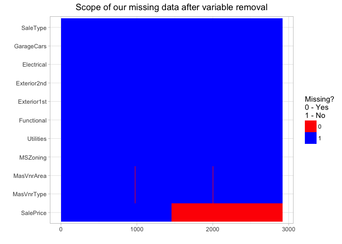

There are only a few `NA` values left, and those will be taken care of next by filtering out all rows that contain `NA` values expect those exclusive to `SalePrice`.

``` r
# we still have a few stragglers of NAs, to make things easy we are just 
# going to remove these rows before we continue
# lets check which column SalePrice is in
which(colnames(all)=="SalePrice")
```

    ## [1] 71

``` r
# we will remove all NA rows excluding ones exclusive to sale price 
# (because half of those are missing on purpose)
all <- all %>% filter(complete.cases(.[,-which(colnames(all)=="SalePrice")]))
```

Now our data contains no `NA` values whatsoever, save for `SalePrice`. We have decreased total observations from the 2919 we started with to only 2883, so we lost just 1.2% of our data by removing the `NA` rows. And lastly, the final data frames of both the numeric and factor variables are set up. These will soon be combined into one single completely cleaned up data set, which will be called `df.combined.num.fac`. Before creating a model, the data will be split into true numeric predictors and the factor variables. This was initially for the purpose of creating a gradient boosting (`xgboost`) model that required additional tweaking to the numeric and factor variables separately, and then would later be combined back into one data frame before modeling. With time constraints, this was not possible (yet), but the data we do have is right now sufficient for a random forest model, which does not require completely numeric predictors, while `xgboost` does.

``` r
# num.var.names was created earlier when the data was first loaded in
# these are no longer true numeric variables
num.var.names <- num.var.names[!(num.var.names %in% c('MSSubClass',
                                                      'MoSold',
                                                      'YrSold',
                                                      'SalePrice',
                                                      'OverallQual', 
                                                      'OverallCond'))]
# adding new numeric variables that we have created
num.var.names <- append(num.var.names, c('Age', 'TotalBath',
                                         'TotalSqFeet',
                                         'TotalPorchSF'))

df.numeric <- all[, names(all) %in% num.var.names]
df.factors <- all[, !(names(all) %in% num.var.names)]
# remove house Id, its not actually a 'numeric' variable
df.Id <- all %>% select(Id)
all <- all %>% select(-Id)
df.numeric <- df.numeric %>% select(-Id)
```

##### Recall: Our response variable SalePrice is skewed!

We should address the skewness of our response variable. Taking a look at the Q-Q Plot, we clearly see a heavy right skew. But after applying a log transformation, we see that it looks much more normal now from the histogram and the Q-Q Plot post log transform, so we will continue by replacing `SalePrice` with log(SalePrice).

``` r
par(mfrow=c(1,2))
qqnorm(all$SalePrice, main = "Normal Q-Q Plot")
qqline(all$SalePrice)
# take the log, looks much more normal
qqnorm(log(all$SalePrice), main = "Normal Q-Q Plot, post log transform")
qqline(log(all$SalePrice))
```

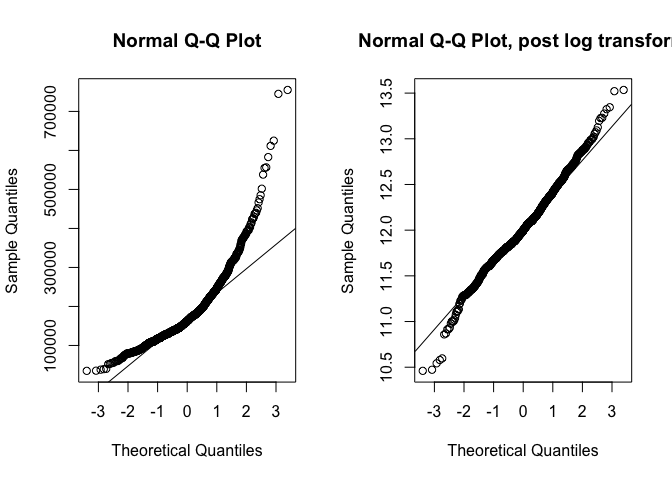

``` r
all$SalePrice <- log(all$SalePrice)

ggplot(data = all) +
    geom_histogram(mapping = aes(x=SalePrice), col = 'gray',
                   fill = 'darkblue') + 
    labs(title = "SalePrice, post log transform") +
    theme(plot.title = element_text(hjust = 0.5))
```


``` r
df.factors <- df.factors %>% mutate(SalePrice = all$SalePrice)
# log transform our response var in the data set, 
# all$SalePrice was transformed, SalePrice in df.factors was not
```

 

##### Implementing a Random Forest regression model

Now that the data is as ready as it can be at this time, modeling can begin. One issue that arose as we approached the modeling stage was the fact that our data, from the *House Prices: Advanced Regression Techniques* Kaggle competition was already pre-split into training and testing data sets. The test data provided has no `SalePrice` variable within the data. This makes sense and is fine for the purpose of the Kaggle competition where the goal is predict the prices for the test data and submit them to Kaggle, but we realized it doesn't work for our purposes here. We have to split the provided training data, `train.csv`, and treat it as the entrie data set where we then split off 20% of the data to be a testing set. This is because we need a test set that contains `SalePrice` so that we can actually calculate the error, something that we could not do with the already provided designated testing set.

``` r
# now we can combine the numeric variables and the factor variables
# and then, split into training and testing sets. this is sufficient for 
# a random forest model
df.combined.num.fac <- cbind(df.numeric, df.factors)

# for the purpose of being able to create a test set that contains
# SalePrice data, the original train data will be split into
# new train and test sets (OG test data never had SalePrice)
# this will be accomplished by just dropping NA rows, aka
# all the original test data
df.combined.num.fac <- df.combined.num.fac %>% drop_na()
dim(df.combined.num.fac)
```

    ## [1] 1449   77

Now we are working with a smaller 1449x77 data frame, and from this we will split into train and test (because of the aforementioned constraints we had).

``` r
# create random indexes of test houses to be removed, 
# 80/20 train/test split
n.houses <- nrow(df.combined.num.fac)
test.index.houses <- sample.int(n.houses, size = round(0.2*n.houses))

train.num.fac <- df.combined.num.fac[-test.index.houses, ]

test.num.fac <- df.combined.num.fac[test.index.houses, ]
```

The model we are using, random forest, is an ensemble learning method which we are using for the purpose of regression. What a random forest does is construct a large specified amount of decision trees at training time and then outputs the mean prediction of the individual trees. Random forests also do not have the problem of over-fitting, which is common in decision trees. For our model, we choose 500 trees and 26 variables for the algorithm to select for each split in a tree. We believe, from our exploratory analysis that we will find the `TotalSqFeet`, `OverallQual` and `Neighborhood` to be among the top most important variables in prediciting `SalePrice`

``` r
form1 <- as.formula("SalePrice ~ .")

rf.fit <- randomForest(form1, data = train.num.fac, ntree = 500, mtry = 26, importance = TRUE)

rf.fit
```

    ## 
    ## Call:
    ##  randomForest(formula = form1, data = train.num.fac, ntree = 500,      mtry = 26, importance = TRUE) 
    ##                Type of random forest: regression
    ##                      Number of trees: 500
    ## No. of variables tried at each split: 26
    ## 
    ##           Mean of squared residuals: 0.01778158
    ##                     % Var explained: 88.56

``` r
plot(rf.fit)
```

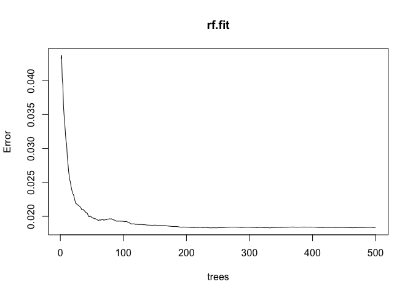

We notice that the error stabilizes after about 150 trees but continues to slowly decrease and so we decided to stick with the safe number of 500 total trees. Also, we see that over 88% of variance is explained by the model. This is an indicator of how good our model may be.

Taking a look at the most important variables, we notice that `TotalSqFeet` and `OverallQual` have the greatest importance for this model, and are followed by `Neighborhood` and `GrLivArea`. This indicates that when it comes to deciding on a sale price for a house, the greatest factors to consider by a long shot are the total square footage and the overall quality of the material and finish of the house, and the neighborhood the house falls in as well as the square footage of just the living area (above ground) are also things to consider, all in that order.

``` r
imprtnt <- importance(rf.fit) %>% 
    as.data.frame() %>%
    rownames_to_column() %>%
    arrange(desc(IncNodePurity))
head(imprtnt)
```

    ##        rowname  %IncMSE IncNodePurity
    ## 1  TotalSqFeet 36.68181     42.754634
    ## 2  OverallQual 23.94230     36.887834
    ## 3 Neighborhood 29.02809     18.013707
    ## 4    GrLivArea 19.59040     14.379023
    ## 5    ExterQual 10.46814      9.502072
    ## 6    YearBuilt 11.71657      5.434059

``` r
varImpPlot(rf.fit, cex = 0.7)
```

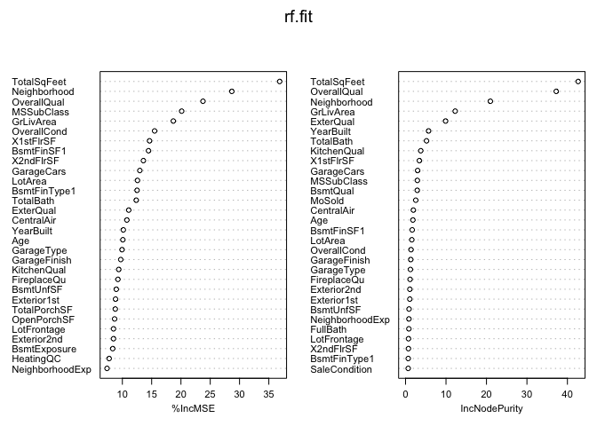

Our random forest model now faces evaluation. First off, we want to calcualte the root of the Mean Squared-Error (RMSE). This is a satisfactory metric to use to compare the performance of the test set as well.

``` r
# standard way to evaluate model accuracy on continuous data is to
# compare the root mean squared error (RMSE)
train.num.fac <- train.num.fac %>%
    mutate(SalePrice.hat = predict(rf.fit)) # get predictors

train.error <- (train.num.fac$SalePrice.hat - train.num.fac$SalePrice)
(RMSE.rf.train <- sqrt(mean((train.error)^2, na.rm=T)))
```

    ## [1] 0.1333476

For a visual of the predicted prices for the trained model, `SalePrice.hat`, and the actual prices, `SalePrice`, we plot a scatter plot and check the correlation between the two variables to check how close the predictions actually got to the real values.

``` r
# check the predicted prices vs the actual sale prices of training data
train.corr <- round(cor(train.num.fac$SalePrice.hat, train.num.fac$SalePrice), 4)
cat("Correlation =", train.corr)
```

    ## Correlation = 0.9463

``` r
ggplot(train.num.fac, aes(x=SalePrice.hat, y=SalePrice)) +
    geom_point() + geom_smooth(method=lm, se=FALSE) + 
    labs(title = 'Predicted and Actual Sale Price, Training Data',
         x = 'Predicted Sale Price', y = 'Actual Sale Price') + 
    annotate("text", x = 11.45, y = 13, label = paste(
        'Correlation =',train.corr), cex = 4 )
```

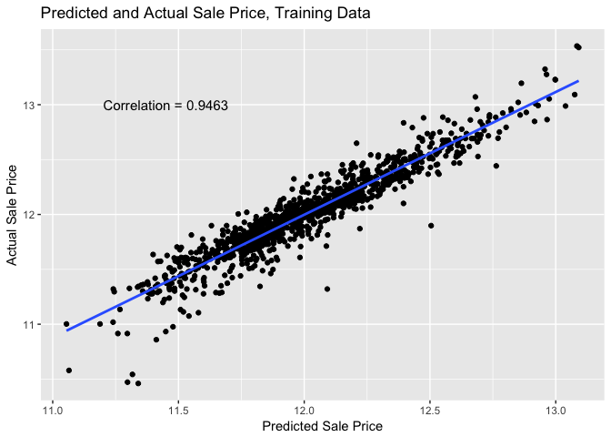 We have a satisfactory result and it seems our model is doing quite well, but to be sure it is not actually over-fit and therefore able to predict `SalePrice` with artificial accuracy, we have to also test the model on unseen data, and this is where our test set that we split off earlier comes in. We notice that the RMSE for the test data is not much different from the train data, therefore we believe the model performs very well and is not over-fit, as evidenced by it's performance on unseen data.

``` r
# model on test data
test.num.fac <- test.num.fac %>%
    mutate(SalePrice.hat = predict(rf.fit, newdata = test.num.fac)) # get predictors

test.error <- (test.num.fac$SalePrice.hat - test.num.fac$SalePrice)

(RMSE.rf.test <- sqrt(mean((test.error)^2, na.rm=T)))
```

    ## [1] 0.141513

``` r
# what is the actual difference between the test and train RMSE?
RMSE_diff <- round(((RMSE.rf.test - RMSE.rf.train) / RMSE.rf.train )*100, 2)

cat("The test RMSE is about ", RMSE_diff,"% different from the train RMSE.")
```

    ## The test RMSE is about  6.12 % different from the train RMSE.

``` r
# we'll check the predicted and actual prices
test.corr <- round(cor(test.num.fac$SalePrice.hat, test.num.fac$SalePrice), 4)

cat("Correlation =", test.corr)
```

    ## Correlation = 0.9463

``` r
ggplot(test.num.fac, aes(x=SalePrice.hat, y=SalePrice)) +
    geom_point() + geom_smooth(method=lm, se=FALSE) + 
    labs(title = 'Predicted and Actual Sale Price, Testing Data',
         x = 'Predicted Sale Price', y = 'Actual Sale Price') + 
    annotate("text", x = 11.5, y = 12.9, label = paste(
        'Correlation =',test.corr), cex = 4 )
```

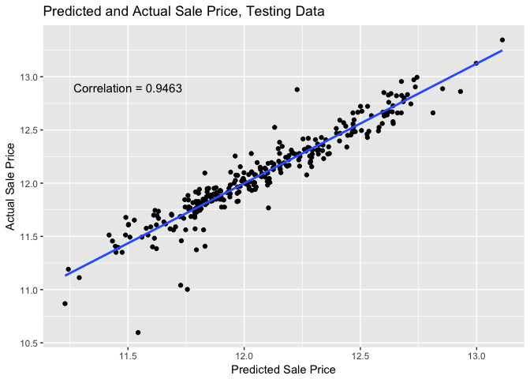

##### Conclusion

In closing, we believe that our random forest model has performed adequately. We observed that the most important variables were `TotalSqFeet` and `OverallQual` and are followed by `Neighborhood` and `GrLivArea`. We had a feeling that these variables would end up being the most influential, given common sense and knowledge of how housing markets work. We are pleased to be able to affirm these ideas. In evaluating our model, we noticed how well it actually ended up performing, with a relatively close difference between the test and train RMSE values.

    ## The test RMSE is about 6.12 % different from the train RMSE.

We conlclude that the model did not over-fit in the training phase, and this may come as expected when considering the robustness of random forest models and their ability to not over-fit, where as the decision tree counter part would. The comparisons of the predicted sale price and actual sale price of the houses for both the training data and the test data were really telling of the overall performance and accuracy of our final model.
